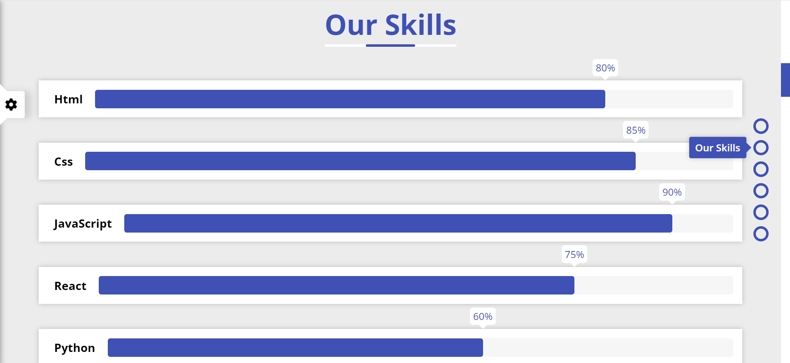

# Special Design

Special Design is a customizable website application built using HTML5, CSS3, and JavaScript. It allows users to personalize their experience by selecting options like the main color of the website, enabling or disabling random backgrounds, and displaying navigational bullets for easy scrolling between sections.

## Table of Contents

- [Demo](#demo)
- [Features](#features)
- [Installation](#installation)
- [Usage](#usage)
- [Technologies](#technologies)

## Demo

You can see a live demo of the application here:

# https://abderraoufselidja.github.io/HTML-CSS-JavaScript_Special_Design/

## Features

- Responsive Design: The website is fully responsive, ensuring a seamless user experience on all devices, including desktops, tablets, and mobile phones.
- Color Customization: Users can change the main color of the website to match their preferences.
- Random Backgrounds: Option to enable or disable random backgrounds for the Home Page.
- Navigational Bullets: Easy navigation through different sections of the website using bullets like "About Us," "Our Skills," and more.
- Persistent Settings: User preferences are stored using Local Storage to maintain settings between sessions.

## Installation

To get a local copy up and running, follow these steps:

1. Clone the repository:

   git clone git@github.com:AbderraoufSelidja/React-MaterialUI-Notes-App.git

2. Navigate to the project directory
    cd special-design 

3. Open the index.html file in your web browser to view the application.
    
## Usage

1- Customize your design by selecting the main color, enabling random backgrounds, and choosing whether to show navigation bullets.

2- The website will automatically save your preferences using Local Storage, so your settings will be maintained even if you close and reopen the browser.

## Technologies

This project is built using the following technologies:

- **HTML5**: Provides the structure and content of the web page.
- **CSS3**: Used for styling and layout of the application, ensuring a visually appealing and responsive design.
- **JavaScript**: Handles the interactive elements of the site, including user customization and local storage management.
- **Local Storage:**: Allows for persistent storage of user preferences, maintaining settings across sessions.

